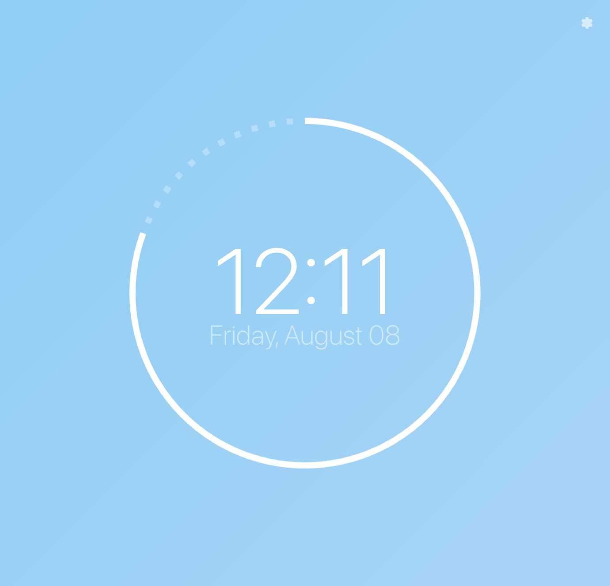
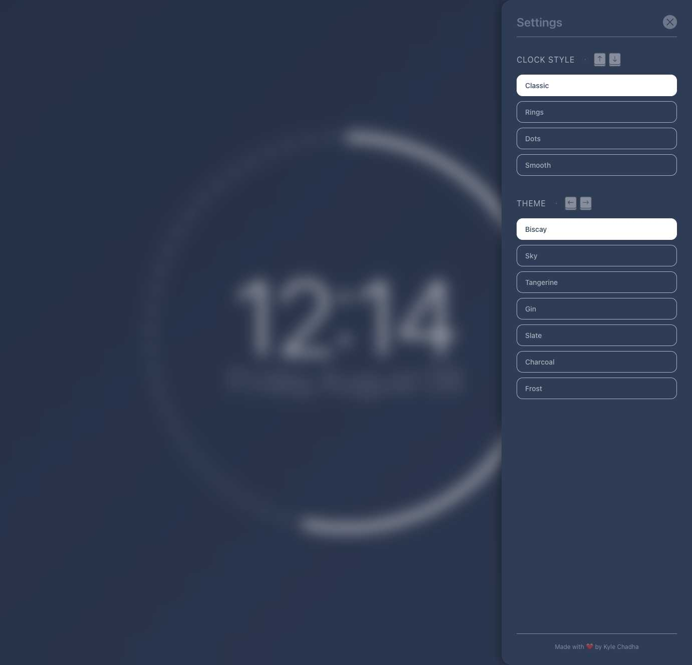

# Simple New Tab

A minimalist Chrome browser extension that replaces your new tab page with a clean, animated clock interface.

<div align="center">
  
  
  <br/>
  <em>Sky theme with Classic visualization&nbsp;&nbsp;&nbsp;&nbsp;&nbsp;&nbsp;&nbsp;&nbsp;&nbsp;&nbsp;&nbsp;&nbsp;&nbsp;&nbsp;&nbsp;&nbsp;&nbsp;&nbsp;&nbsp;&nbsp;&nbsp;&nbsp;&nbsp;&nbsp;&nbsp;&nbsp;&nbsp;&nbsp;&nbsp;&nbsp;Settings modal with Biscay theme</em>
</div>

## Features

- **4 Unique Visualizations**: Multiple clock styles and visual effects (up/down arrow keys)
- **7 Color Themes**: Navigate themes with left/right arrow keys  
- **Settings Modal**: Interactive settings interface with visual previews (click gear icon)
- **Dynamic Text Sizing**: Automatically balances time and date text for optimal visual weight
- **Zero Dependencies**: Pure vanilla JavaScript with native APIs
- **Responsive Design**: Adapts to all screen sizes from mobile to ultrawide monitors
- **Accessibility**: Full keyboard navigation and screen reader support
- **Performance Optimized**: Hardware-accelerated animations and modern rendering

## Navigation

**Themes** (Left/Right arrows): 7 beautiful color schemes
- Biscay, Sky Blue, Tangerine, Gin, Slate, Charcoal, Frost

**Visualizations** (Up/Down arrows): 4 unique clock styles
- Classic, Rings, Dots, Smooth

## Development

```bash
# Install dependencies
npm install

# Start development server
npm run dev

# Build extension for Chrome Web Store
npm run build
```

Load the unpacked extension in Chrome developer mode for testing.

## Architecture

- **No build process**: Simple client-side extension
- **Modern web standards**: Uses CSS custom properties, SVG animations
- **Lightweight**: Optimized for fast loading and smooth performance

---

Created with ❤️ by [Kyle Chadha](https://x.com/kylechadha)